# 🇮🇳 IndiaAI IDP Platform

     

> **Product Vision:** India's first "Sovereign-by-Design" Document Intelligence Platform that democratizes AI for every government department, ensuring data never leaves the premise.

## 🚀 The "0 to 1" Product Journey

We are building this platform to solve a specific, high-stakes problem: **How do we bring modern AI to legacy government workflows without compromising data sovereignty?**

### The "Zero" State (Current Reality)
*   **Data Risk:** Departments use public cloud OCR tools, leaking sensitive citizen data (Aadhaar/PAN) to foreign servers.
*   **Vendor Lock-in:** Proprietary solutions are expensive and hard to customize.
*   **Compliance Gap:** No existing tool natively enforces the **DPDP Act 2023** (Consent, Purpose, Retention).

### The "One" State (Our MVP Goal)
A **self-contained, air-gapped AI platform** that any department can spin up in 10 minutes on a standard laptop. It must be:
1.  **Sovereign:** Runs 100% locally. No internet required after setup.
2.  **Modular:** Starts small (SQLite/Local) but ready to scale (Postgres/S3).
3.  **Governance-First:** Compliance is code, not a policy document.

## 📸 Product Screenshots

### Homepage

*Landing page with DPDP Act 2023 disclaimer and upload workflow introduction.*

### Upload Page - DPDP Compliance UI

*Purpose selection and consent verification enforced before document processing.*

### Document Processing & Results

*Side-by-side document viewer with extracted text and confidence scores.*

### Document Viewer with Bounding Boxes

*PDF viewer with visual bounding boxes highlighting detected text regions.*

### Human-in-the-Loop Review Interface

*Manual review page for low-confidence extractions with inline editing.*

---

## 💡 Product Strategy: The "Lego Block" Architecture

As a 0-1 product, we prioritized **adaptability** over raw scale. We chose a modular architecture that allows the platform to evolve with the user's maturity.

```mermaid
%%{init: {'theme':'base', 'themeVariables': { 'primaryColor':'#E8F5E9','primaryTextColor':'#1B5E20','primaryBorderColor':'#388E3C','lineColor':'#FF6F00','secondaryColor':'#FFF3E0','tertiaryColor':'#E3F2FD'}}}%%
graph TB
    subgraph local["🖥️ Phase 0: Local MVP"]
        direction TB
        SQLite[("💾 SQLite")]
        LocalFS["📁 Local Disk"]
        MemQ["⚡ Memory Queue"]
        
        style SQLite fill:#4CAF50,stroke:#2E7D32,stroke-width:3px,color:#fff
        style LocalFS fill:#4CAF50,stroke:#2E7D32,stroke-width:3px,color:#fff
        style MemQ fill:#4CAF50,stroke:#2E7D32,stroke-width:3px,color:#fff
    end
    
    subgraph prod["☁️ Phase 1: Production"]
        direction TB
        Postgres[("🐘 PostgreSQL")]
        S3["🪣 R2/S3"]
        Redis["🔴 Redis"]
        
        style Postgres fill:#2196F3,stroke:#1565C0,stroke-width:3px,color:#fff
        style S3 fill:#2196F3,stroke:#1565C0,stroke-width:3px,color:#fff
        style Redis fill:#2196F3,stroke:#1565C0,stroke-width:3px,color:#fff
    end
    
    Core["🎯 IDP Core Logic"]
    
    Core -->|DB| SQLite
    Core -->|DB| Postgres
    Core -->|Storage| LocalFS
    Core -->|Storage| S3
    Core -.->|Queue| MemQ
    Core -.->|Queue| Redis
    
    style Core fill:#FF6F00,stroke:#E65100,stroke-width:4px,color:#fff,font-size:16px
    style local fill:#E8F5E9,stroke:#388E3C,stroke-width:2px,stroke-dasharray: 5 5
    style prod fill:#E3F2FD,stroke:#1976D2,stroke-width:2px,stroke-dasharray: 5 5
```

*   **Why this matters:** We don't force a District Collector to set up Kubernetes. They start with "Phase 0". When they grow to a State-level deployment, they flip a config switch to "Phase 1". **This is product thinking, not just engineering.**

---

## 🛡️ Core Value Proposition: Governance as a Feature

In the era of Digital India, **Trust is the Product**. We built governance directly into the user flow.

*   **Purpose-Driven Uploads:** Users *cannot* upload a file without declaring *why* (e.g., "KYC Verification").
*   **Consent Verification:** The system enforces a "Consent Verified" check before processing.
*   **Tamper-Evident Audit:** Every pixel processed is logged. Who, When, Why, and Where.
*   **Human-in-the-Loop:** Low-confidence extractions (< 90%) are automatically flagged for manual review.

---

## 📚 Documentation for Builders

*   [**Setup Guide (MVP)**](docs/SETUP.md) - Get the "Phase 0" version running in 5 minutes.
*   [**Troubleshooting**](docs/TROUBLESHOOTING.md) - Solutions for common "0 to 1" hurdles.
*   [**Architecture Deep Dive**](backend/ARCHITECTURE.md) - The technical blueprint with visual diagrams.
*   [**ADRs (Architecture Decisions)**](docs/adr/) - Key technical decisions documented.

---

## 🛠️ Tech Stack (Pilot Implementation)

### Backend
   

- **OCR Engine:** PaddleOCR (PP-OCRv4) - 95-98% accuracy, ~2s/page
- **Database:** SQLite (dev) / PostgreSQL (prod-ready)
- **Storage:** Local Filesystem / R2 (S3-compatible)
- **Queue:** In-Memory (dev) / Redis (prod-ready)

### Frontend
   

### **Future Enhancements (Post-Pilot)**
- **LLM Structuring:** Ollama (local) for semantic document parsing
- **Vector DB:** ChromaDB for document similarity search

---

> *"We are not just building software; we are building the digital trust infrastructure for a billion citizens."*

---

## 👤 Author & Maintainer

**Vikas Sahani**
*   **GitHub:** [VIKAS9793](https://github.com/VIKAS9793)
*   **LinkedIn:** [Vikas Sahani](https://www.linkedin.com/in/vikas-sahani-727420358)
*   **Email:** vikassahani17@gmail.com
*   **Kaggle:** [vikassahani9793](https://www.kaggle.com/vikassahani9793)
*   **Developer Profile:** [g.dev/vikas9793](https://g.dev/vikas9793)

---

## 📄 License
This project is licensed under the MIT License - see the [LICENSE](LICENSE) file for details.

