# 🇮🇳 IndiaAI IDP Platform

     

> **Product Vision:** India's first "Sovereign-by-Design" Document Intelligence Platform that democratizes AI for every government department, ensuring data never leaves the premise.

## 🚀 The "0 to 1" Product Journey

We are building this platform to solve a specific, high-stakes problem: **How do we bring modern AI to legacy government workflows without compromising data sovereignty?**

### The "Zero" State (Current Reality)
*   **Data Risk:** Departments use public cloud OCR tools, leaking sensitive citizen data (Aadhaar/PAN) to foreign servers.
*   **Vendor Lock-in:** Proprietary solutions are expensive and hard to customize.
*   **Compliance Gap:** No existing tool natively enforces the **DPDP Act 2023** (Consent, Purpose, Retention).

### The "One" State (Our MVP Goal)
A **self-contained, air-gapped AI platform** that any department can spin up in 10 minutes on a standard laptop. It must be:
1.  **Sovereign:** Runs 100% locally. No internet required after setup.
2.  **Modular:** Starts small (SQLite/Local) but ready to scale (Postgres/S3).
3.  **Governance-First:** Compliance is code, not a policy document.

---

## 📸 UX4G-Compliant User Interface

Our platform now features a **Government of India Design System (UX4G v2.0.8)** compliant interface, ensuring accessibility and consistency with government standards.

### Main Dashboard

*Homepage with UX4G navigation, tricolor branding, and legal disclaimers.*

*Feature showcase with UX4G cards and government-approved color palette.*

### Document Upload Interface

*DPDP Act 2023 compliance: language selection, purpose declaration, and consent verification.*

*Drag-and-drop upload with UX4G form controls and progress indicators.*

### Legal & Accessibility

*Comprehensive legal disclaimers and prototype notices using UX4G alert components.*

*Full disclosure page with UX4G cards and government-compliant typography.*

*UX4G Accessibility Widget integration for inclusive design.*

---

## 💡 Product Strategy: The "Lego Block" Architecture

As a 0-1 product, we prioritized **adaptability** over raw scale. We chose a modular architecture that allows the platform to evolve with the user's maturity.

```mermaid
%%{init: {'theme':'base', 'themeVariables': { 'primaryColor':'#E8F5E9','primaryTextColor':'#1B5E20','primaryBorderColor':'#388E3C','lineColor':'#FF6F00','secondaryColor':'#FFF3E0','tertiaryColor':'#E3F2FD'}}}%%
graph TB
    subgraph local["🖥️ Phase 0: Local MVP"]
        direction TB
        SQLite[("💾 SQLite")]
        LocalFS["📁 Local Disk"]
        MemQ["⚡ Memory Queue"]
        
        style SQLite fill:#4CAF50,stroke:#2E7D32,stroke-width:3px,color:#fff
        style LocalFS fill:#4CAF50,stroke:#2E7D32,stroke-width:3px,color:#fff
        style MemQ fill:#4CAF50,stroke:#2E7D32,stroke-width:3px,color:#fff
    end
    
    subgraph prod["☁️ Phase 1: Production"]
        direction TB
        Postgres[("🐘 PostgreSQL")]
        S3["🪣 R2/S3"]
        Redis["🔴 Redis"]
        
        style Postgres fill:#2196F3,stroke:#1565C0,stroke-width:3px,color:#fff
        style S3 fill:#2196F3,stroke:#1565C0,stroke-width:3px,color:#fff
        style Redis fill:#2196F3,stroke:#1565C0,stroke-width:3px,color:#fff
    end
    
    Core["🎯 IDP Core Logic"]
    
    Core -->|DB| SQLite
    Core -->|DB| Postgres
    Core -->|Storage| LocalFS
    Core -->|Storage| S3
    Core -.->|Queue| MemQ
    Core -.->|Queue| Redis
    
    style Core fill:#FF6F00,stroke:#E65100,stroke-width:4px,color:#fff,font-size:16px
    style local fill:#E8F5E9,stroke:#388E3C,stroke-width:2px,stroke-dasharray: 5 5
    style prod fill:#E3F2FD,stroke:#1976D2,stroke-width:2px,stroke-dasharray: 5 5
```

*   **Why this matters:** We don't force a District Collector to set up Kubernetes. They start with "Phase 0". When they grow to a State-level deployment, they flip a config switch to "Phase 1". **This is product thinking, not just engineering.**

---

## 🛡️ Core Value Proposition: Governance as a Feature

In the era of Digital India, **Trust is the Product**. We built governance directly into the user flow.

*   **Purpose-Driven Uploads:** Users *cannot* upload a file without declaring *why* (e.g., "KYC Verification").
*   **Consent Verification:** The system enforces a "Consent Verified" check before processing.
*   **Tamper-Evident Audit:** Every pixel processed is logged. Who, When, Why, and Where.
*   **Human-in-the-Loop:** Low-confidence extractions (< 90%) are automatically flagged for manual review.

---

## 📚 Documentation for Builders

> **🚀 One-Click Setup:** 
> - **Windows:** [`setup.ps1`](setup.ps1) 
> - **Linux/Mac:** [`setup.sh`](setup.sh)

*   [**Setup Guide (MVP)**](docs/SETUP.md) - Get the "Phase 0" version running in 5 minutes.
*   [**Troubleshooting**](docs/TROUBLESHOOTING.md) - Solutions for common "0 to 1" hurdles.
*   [**Architecture Deep Dive**](backend/ARCHITECTURE.md) - The technical blueprint with visual diagrams.
*   [**Security Policy**](docs/SECURITY.md) - Security guidelines, CI/CD setup, and vulnerability reporting.
*   [**ADRs (Architecture Decisions)**](docs/adr/) - Key technical decisions documented.

---

## 🛠️ Tech Stack

### Backend
   

- **OCR Engine:** PaddleOCR (PP-OCRv4) - 95-98% accuracy, ~2s/page
- **Database:** SQLite (dev) / PostgreSQL (prod-ready)
- **Storage:** Local Filesystem / R2 (S3-compatible)
- **Queue:** In-Memory (dev) / Redis (prod-ready)

### Smart Search (v2.0)
 

- **Vector Search:** ChromaDB + sentence-transformers (semantic similarity)
- **Full-Text Search:** SQLite FTS5 (BM25 ranking, zero dependencies)
- **Hybrid Search:** Combined keyword + semantic results
- **PDF Processing:** pdf2image + Poppler (multi-page support)

### Frontend (v3.0 - UX4G Migration)
   

**UI Framework:** [**UX4G v2.0.8**](https://ux4g.gov.in/) (Government of India Design System)
- Official CDN: `https://cdn.ux4g.gov.in/UX4G@2.0.8/`
- Documentation: [ux4g.gov.in/docs](https://ux4g.gov.in/docs)
- Font: [Noto Sans](https://fonts.google.com/noto/specimen/Noto+Sans) (Government-approved typography)
- Accessibility: UX4G Accessibility Widget integrated
- Icons: Inline SVGs (no external dependencies)

**Migration Stats (Tailwind CSS → UX4G):**
- ✅ 11 Core Components migrated (Header, Footer, Breadcrumbs, Button, Alert, Card, etc.)
- ✅ 7 Pages migrated (HomePage, UploadPage, ResultsPage, ReviewPage, etc.)
- ✅ Tricolor branding and national emblem placeholders
- ✅ Full UX4G component library compliance
- ✅ Removed Tailwind CSS and lucide-react dependencies

### **Future Enhancements (Post-Pilot)**
- **LLM Structuring:** Ollama (local) for semantic document parsing
- **JWT Authentication:** Role-based access control
- **Redis Cache:** Performance optimization

---

## 🏛️ Design System Attribution

This project uses the **UX4G Design System v2.0.8**, developed and maintained by the **Government of India**.

- **Official Website:** [ux4g.gov.in](https://ux4g.gov.in/)
- **Documentation:** [ux4g.gov.in/docs](https://ux4g.gov.in/docs)
- **CDN:** [cdn.ux4g.gov.in](https://cdn.ux4g.gov.in/)
- **License:** UX4G is a government-owned design system for public use
- **Copyright:** © Government of India. All design system assets and branding are property of the Government of India.

**Note:** This project is an independent prototype and is NOT affiliated with or endorsed by the Government of India or the IndiaAI initiative. The use of UX4G is solely for demonstrating government-compliant UI design patterns.

---

> *"We are not just building software; we are building the digital trust infrastructure for a billion citizens."*

---

## 👤 Author & Maintainer

**Vikas Sahani**
*   **GitHub:** [VIKAS9793](https://github.com/VIKAS9793)
*   **LinkedIn:** [Vikas Sahani](https://www.linkedin.com/in/vikas-sahani-727420358)
*   **Email:** vikassahani17@gmail.com
*   **Kaggle:** [vikassahani9793](https://www.kaggle.com/vikassahani9793)
*   **Developer Profile:** [g.dev/vikas9793](https://g.dev/vikas9793)

---

## 📄 License
This project is licensed under the MIT License - see the [LICENSE](LICENSE) file for details.

**Third-Party Attributions:**
- UX4G Design System © Government of India
- Noto Sans Font © Google Fonts (SIL Open Font License 1.1)
