# Modular Architecture - 0 to Scale

## Design Philosophy

**Core Principle:** Plugin architecture with **zero code changes** to scale from local MVP to 100M+ users.

**SWE Principles Applied:**
- **Single Responsibility**: Each service does ONE thing
- **Open/Closed**: Open for extension (new backends), closed for modification
- **Liskov Substitution**: All implementations interchangeable
- **Interface Segregation**: Clean abstract base classes
- **Dependency Inversion**: Depend on abstractions, not concrete implementations

## System Architecture

```mermaid
%%{init: {'theme':'base', 'themeVariables': { 'primaryColor':'#E8F5E9','secondaryColor':'#FFF3E0','tertiaryColor':'#E3F2FD','lineColor':'#FF6F00'}}}%%
graph TB
    subgraph client["👥 Client Layer"]
        UI["🌐 React UI<br/>(Vite + UX4G v2.0.8)"]
    end
    
    subgraph api["🔌 API Layer"]
        FastAPI["⚡ FastAPI Server<br/>main.py"]
        Routes["📍 Routes<br/>(Upload, Jobs, Review, Search)"]
    end
    
    subgraph core["🧠 Business Logic"]
        Worker["⚙️ Background Worker<br/>Async Task Processing"]
        OCR["🔍 OCR Service<br/>(PaddleOCR)"]
        PII["🛡️ PII Detection<br/>Security Layer"]
        Audit["📋 Audit Service<br/>DPDP Compliance"]
        Vector["🧠 Vector Service<br/>(ChromaDB)"]
        Search["🔎 Search Service<br/>(SQLite FTS5)"]
    end
    
    subgraph storage["💾 Data Layer"]
        DB[("🗄️ Database<br/><i>SQLite/PostgreSQL</i>")]
        Files["📦 Storage<br/><i>Local/R2</i>"]
        Queue["📬 Queue<br/><i>Memory/Redis</i>"]
        VectorDB[("🧲 ChromaDB<br/><i>Embeddings</i>")]
    end
    
    UI -->|HTTPS| FastAPI
    FastAPI --> Routes
    Routes -->|Enqueue Task| Queue
    Routes -->|Save Job| DB
    Routes -->|Upload File| Files
    Routes -->|Search| Search
    Routes -->|Semantic Search| Vector
    
    Worker -->|Poll Tasks| Queue
    Worker -->|Process| OCR
    Worker -->|Check PII| PII
    Worker -->|Save Results| DB
    Worker -->|Log Actions| Audit
    Worker -->|Index| Search
    Worker -->|Embed| Vector
    
    Vector -->|Store| VectorDB
    Audit -->|Persist| DB
    
    style UI fill:#2196F3,stroke:#1565C0,stroke-width:3px,color:#fff
    style FastAPI fill:#FF6F00,stroke:#E65100,stroke-width:3px,color:#fff
    style Worker fill:#4CAF50,stroke:#2E7D32,stroke-width:3px,color:#fff
    style DB fill:#9C27B0,stroke:#6A1B9A,stroke-width:3px,color:#fff
    style Files fill:#9C27B0,stroke:#6A1B9A,stroke-width:3px,color:#fff
    style Queue fill:#9C27B0,stroke:#6A1B9A,stroke-width:3px,color:#fff
    style VectorDB fill:#E91E63,stroke:#C2185B,stroke-width:3px,color:#fff
    style Vector fill:#00BCD4,stroke:#00838F,stroke-width:3px,color:#fff
    style Search fill:#00BCD4,stroke:#00838F,stroke-width:3px,color:#fff
    style client fill:#E3F2FD,stroke:#1976D2,stroke-width:2px,stroke-dasharray: 5 5
    style api fill:#FFF3E0,stroke:#F57C00,stroke-width:2px,stroke-dasharray: 5 5
    style core fill:#E8F5E9,stroke:#388E3C,stroke-width:2px,stroke-dasharray: 5 5
    style storage fill:#F3E5F5,stroke:#7B1FA2,stroke-width:2px,stroke-dasharray: 5 5
```




## Modular Components

### 1. Database Layer

**Abstraction:** `app/core/database.py`

**Backends:**
| Backend | Use Case | Setup | Cost |
|---------|----------|-------|------|
| **SQLite** | Local dev, MVP, prototype | Zero config | $0 |
| **PostgreSQL** | Production 100M+ | Supabase/RDS | Variable |

**Swap Strategy:**
```env
# Local/MVP
DATABASE_TYPE=sqlite
SQLITE_DB_PATH=./data/indiaai.db

# Production
DATABASE_TYPE=postgresql
DATABASE_URL=postgresql://...
```

**Code:** NO CHANGES NEEDED. SQLAlchemy abstracts everything.

---

### 2. Storage Layer

**Abstraction:** `app/services/storage.py`

**Interface:**
```python
class StorageService(ABC):
    async def upload(file_key, file_data, content_type) -> str
    async def download(file_key) -> bytes
    async def get_url(file_key, expires_in) -> str
    async def delete(file_key) -> bool
```

**Implementations:**
| Backend | Class | Use Case | Setup | Cost |
|---------|-------|----------|-------|------|
| **Local FS** | `LocalStorageService` | Dev, MVP | Auto-created | $0 |
| **Cloudflare R2** | `R2StorageService` | Production | R2 account | $0-$15/TB |

**Swap Strategy:**
```env
# Local/MVP
STORAGE_TYPE=local
LOCAL_STORAGE_PATH=./data/uploads

# Production
STORAGE_TYPE=r2
R2_ACCOUNT_ID=...
R2_ACCESS_KEY_ID=...
```

**Code:** Factory pattern (`get_storage_service()`) returns correct implementation. Upload route doesn't know which backend.

---

### 3. Queue Layer

**Abstraction:** `app/services/queue.py`

**Interface:**
```python
class QueueService(ABC):
    async def enqueue(task_name, task_data) -> task_id
    async def dequeue() -> task
    async def get_status(task_id) -> status
    async def update_status(task_id, status, data) -> bool
```

**Implementations:**
| Backend | Class | Use Case | Limits | Cost |
|---------|-------|----------|--------|------|
| **In-Memory** | `InMemoryQueueService` | Dev, single-instance MVP | Lost on restart | $0 |
| **Redis** | `RedisQueueService` | Production, distributed | Persistent, scalable | $0-$50/mo |

**Swap Strategy:**
```env
# Local/MVP
QUEUE_TYPE=memory

# Production
QUEUE_TYPE=redis
REDIS_URL=redis://...
```

**Code:** Factory pattern (`get_queue_service()`) returns correct implementation.

---

## Document Processing Flow


---

## Scaling Path: 0 → 1 → 100M Users

### Stage 1: Local Development (NOW)
```env
DATABASE_TYPE=sqlite
STORAGE_TYPE=local
QUEUE_TYPE=memory
```

**Handles:** 1 developer, testing, demos  
**Cost:** $0  
**Code changes to next stage:** 0

---

### Stage 2: MVP/Prototype (1-1000 users)
```env
DATABASE_TYPE=sqlite  # Still fine!
STORAGE_TYPE=local     # Or switch to R2
QUEUE_TYPE=memory      # Single instance OK
```

**Handles:** Early users, validation, feedback  
**Cost:** $0-$5/month (if using R2)  
**Code changes:** 0 (just env vars)

---

### Stage 3: Growth (1K-100K users)
```env
DATABASE_TYPE=postgresql
DATABASE_URL=postgresql://supabase...
STORAGE_TYPE=r2
R2_ACCOUNT_ID=...
QUEUE_TYPE=redis
REDIS_URL=redis://upstash...
```

**Handles:** Growing user base, multiple workers  
**Cost:** $20-$100/month  
**Code changes:** 0 (implementations already exist!)

---

### Stage 4: Scale (100K-100M users)
```env
# Same as Stage 3, just bigger infrastructure
DATABASE_TYPE=postgresql  # Aurora, CockroachDB, etc.
STORAGE_TYPE=r2           # Multi-region buckets
QUEUE_TYPE=redis          # Redis Cluster
```

**Additional:** Load balancers, CDN, caching, horizontal scaling  
**Code changes:** 0 for core platform, add caching layers, read replicas

---

## Implementation Benefits

### 1. **Zero-Friction Local Development**
```bash
# Clone repo
git clone ...

# Activate venv
cd backend
.\activate.ps1

# Install deps
pip install -r requirements.txt

# Run migrations
alembic upgrade head

# Start server
uvicorn main:app --reload
```

**No external services needed!** SQLite DB and local storage auto-created.

### 2. **Environment Parity**
- Developer machine: SQLite + local storage
- Staging: PostgreSQL + R2
- Production: PostgreSQL + R2
- **Same code** across all environments

### 3. **Easy Testing**
```python
# Unit tests use in-memory backends
@pytest.fixture
def storage():
    return LocalStorageService()

# Integration tests use real backends
@pytest.fixture
def storage():
    return R2StorageService()  # Test account
```

### 4. **Gradual Migration**
Can migrate one component at a time:
```env
DATABASE_TYPE=sqlite       # Still local
STORAGE_TYPE=r2            # Moved to cloud
QUEUE_TYPE=memory          # Still local
```

---

## Code Examples

### Upload Endpoint (Never Changes)
```python
@router.post("/upload")
async def upload_document(file: UploadFile):
    # Factory returns correct implementation
    storage = get_storage_service()
    queue = get_queue_service()
    
    # Code same for local FS or R2
    url = await storage.upload(key, data, content_type)
    
    # Code same for memory or Redis
    task_id = await queue.enqueue("process", {...})
    
    return {"job_id": ...}
```

### Adding New Backend
```python
# 1. Create new implementation
class S3StorageService(StorageService):
    async def upload(...):
        # AWS S3 logic
    
# 2. Update factory
def get_storage_service():
    if settings.STORAGE_TYPE == "s3":
        return S3StorageService()
    ...

# 3. Update config
STORAGE_TYPE=s3
AWS_ACCESS_KEY=...
```

**No changes to upload endpoint or any business logic!**

---

## Current Status (Updated: 2025-12-29)

✅ **Database:** SQLite (local/tested) + PostgreSQL (ready for production)  
✅ **Storage:** Local FS (working) + Cloudflare R2 (ready for production)  
✅ **Queue:** In-memory (working) + Redis (ready for production)  
✅ **OCR:** PaddleOCR (PP-OCRv5) + LangChain Integration (working)
✅ **Vector Search:** ChromaDB + sentence-transformers (v2.0)  
✅ **Full-Text Search:** SQLite FTS5 with BM25 ranking (v2.0)  
✅ **PDF Processing:** pdf2image + Poppler (v2.0)

**Next:** LLM layer (Ollama) - same modular pattern

---

## Future Extensions

**Easy to add:**
- Cache layer (local → Redis → Memcached)
- LLM (Ollama → HuggingFace API)
- Analytics (local logs → PostHog → Mixpanel)
- Auth (no auth → JWT → OAuth → Auth0)

**Pattern stays same:**
1. Define abstract interface
2. Implement multiple backends
3. Factory function returns based on config
4. Business logic uses interface

---

**Result:** True 0-to-scale architecture with plugin-based modularity.
